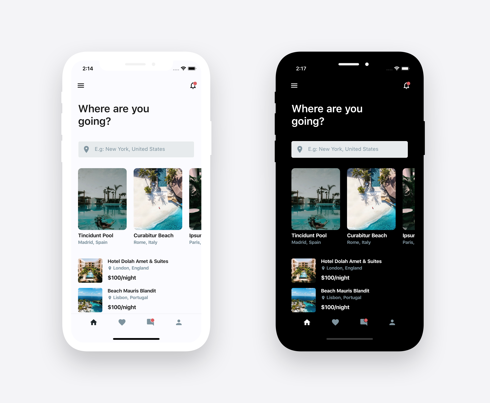
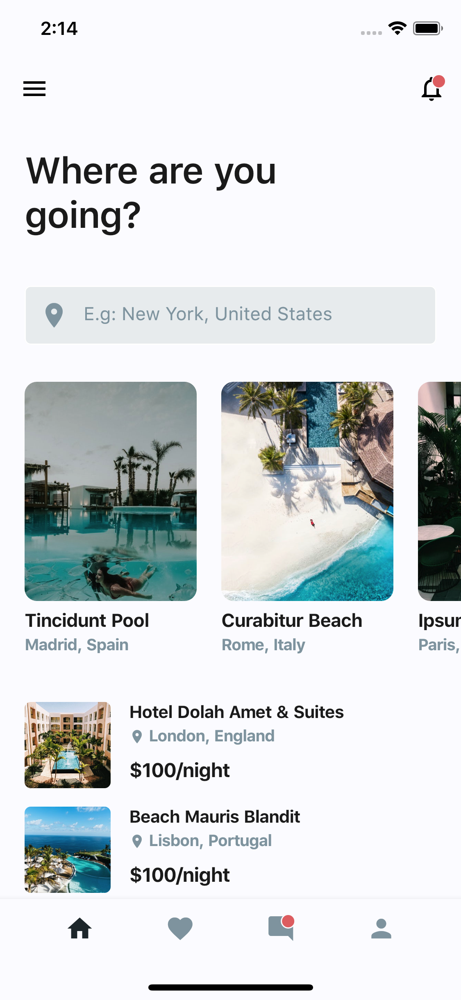
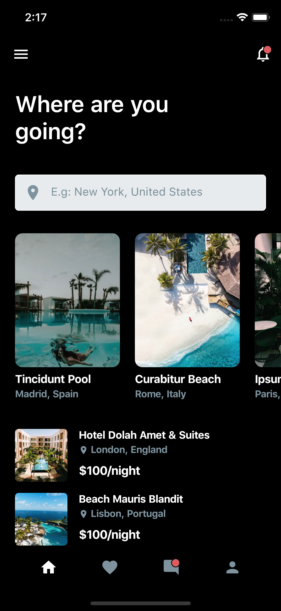
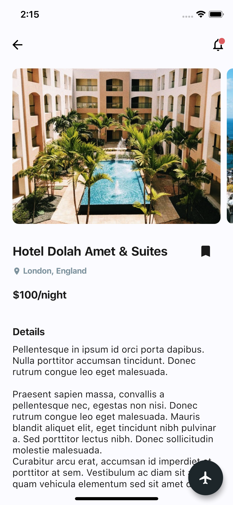
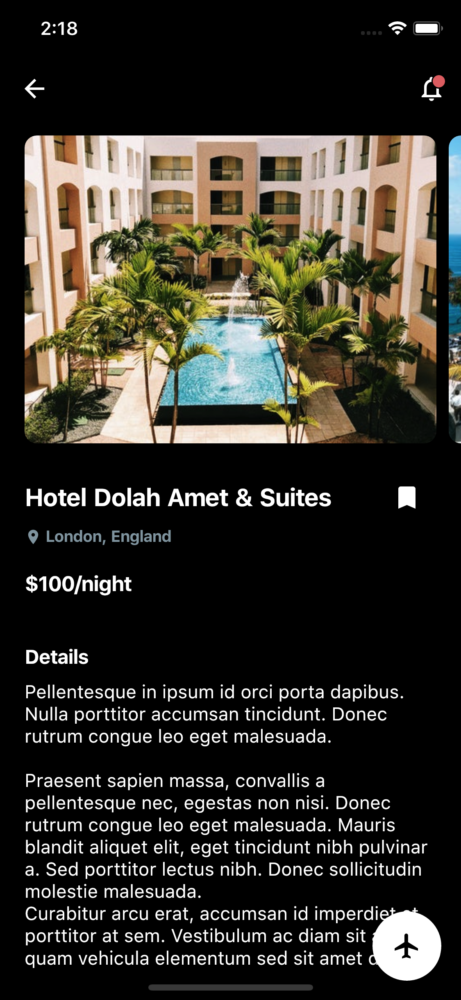

[English](./README.md) | 简体中文
# 🛫Flutter 旅行app 

用Flutter实现了一个简单的旅行类App，
**只包含两页页面（很好学哦）**

喜欢的话给个star⭐哦，😉

图片来自 [Unsplash](https://unsplash.com)
## 📸 App预览

| 1 | 2|
|------|-------|
|||

| 3 | 4|
|------|-------|
|||

## 切换主题
修改`main.dart`里的`isDark`变量即可切换主题

`true`为暗黑主题，`false`为亮白主题

## ✨ 开发要求
* 操作系统 (如：MacOS X, Linux, Windows)
* 任何装了flutter's SDK的编辑器 (如： IntelliJ, Android Studio, VSCode etc)
* 稍微了解dart和flutter
* 会思考的大脑 🤓🤓

## 🤓 作者(s)
**Olusegun Festus Babajide** 

## 快速开始

这是一个学习Flutter开发的入门项目

还有一些不错的开始项目：

- [官方Lab: Write your first Flutter app](https://flutter.io/docs/get-started/codelab)
- [官方Cookbook: Useful Flutter samples](https://flutter.io/docs/cookbook)

要想全面的学习Flutter，阅读官方的
[在线文档](https://flutter.io/docs)。文档提供了大量的教程、例子、移动开发指南和完整的API参考

## LICENCE
[WTFPL](http://www.wtfpl.net/about/)
